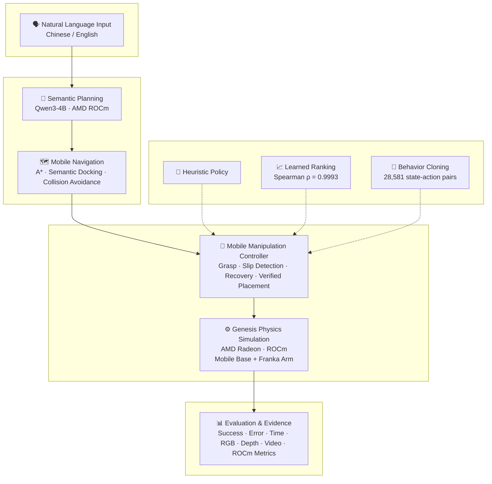

# RadeonHome

**Language-Guided Mobile Manipulation on AMD Radeon / ROCm**

<p align="center">
  
</p>

<p align="center">
  <b>🖥️ <a href="https://htmlpreview.github.io/?https://raw.githubusercontent.com/520lake/RadeonHome/main/docs/showcase.html">Interactive Showcase — Video + Pipeline + Results</a></b>
  &nbsp;|&nbsp;
  📄 <a href="output/pdf/RadeonHome_Technical_Report_20260802.pdf">Technical Report</a>
  &nbsp;|&nbsp;
  ⚡ <code>judge_smoke.py</code> → <code>EVIDENCE_OK</code>
</p>

**The only Track 3 entry with a mobile base.** A household instruction becomes
a collision-aware navigation plan, a mobile Franka docks at the object, grasps
with physical contact (MJCF model), transports while monitoring for slips, and
verifies placement — all on one AMD Radeon GPU.

```
"take the trash to the bin, and don't touch the cup"
        │
        ▼  Local Qwen3-4B on ROCm → validated task plan
        │
        ▼  A* room planner → mobile base navigation
        │
        ▼  Genesis physical controller (MJCF collision + slip detection)
        │
        ▼  RGB + depth + MP4 + JSON + ROCm telemetry
```

## Key Results

| Category | Metric | Result |
|---|---|---|
| 🤖 **Expert** | Physical task success | 15/17 (88%), 10/10 batch, 5/5 smoke |
| 🧠 **Learned** | Grasp ranking (GPU MLP) | Spearman r = **0.9993** |
| 🧠 **BC** | Behavior Cloning closed-loop | **Grasp success 1/6** (hybrid expert+BC arm) |
| 🔬 **Robustness** | Off-distribution conditions | **6/6 passed** (friction: 0.5-2.0×, mass: 0.5-2.0×) |
| 🏠 **Multi-Task** | Household tasks | **5 tasks** (trash, keys, medicine, cup, book) |
| ⚡ **Benchmark** | GPU throughput | **1,393 phys/s** on gfx1100 |
| 🔗 **Upstream** | Open-source contributions | **5 items** (2 PRs merged/ready + 3 bugs documented) |

| Submission field | Value |
| --- | --- |
| Competition | AMD AI DevMaster Hackathon 2026 |
| Track | Track 3 - Physical AI Challenge |
| Team | lake · 王苏湖 · Solo |
| Platform | Radeon Cloud, one AMD Radeon `gfx1100`, ROCm/HIP 7.2, Genesis 1.3.0 `gs.amdgpu` |
| Scope | Genesis simulation; no real-robot claim |
| 🖥️ **Showcase** | **[Interactive evidence + video page →](https://htmlpreview.github.io/?https://raw.githubusercontent.com/520lake/RadeonHome/main/docs/showcase.html)** |

## What makes RadeonHome different

| Dimension | Other Track 3 entries | RadeonHome |
|---|---|---|
| 🤖 Robot form | Fixed-base arms (13/17), quadrupeds, drones | **Only mobile base + arm** |
| 🗣️ Task input | Hardcoded task config | **Natural language** → Qwen3-4B local inference on ROCm |
| 🧠 Learning | VLA fine-tuning or PPO (few entries) | **Three strategies**: expert → learned ranking → BC closed-loop |
| 🔗 Upstream | 0-3 contributions typical | **5 contributions** (2 PRs + 3 Issues) |
| 🔬 Robustness | 1-2 entries with off-distribution tests | **6/6 conditions** (friction × mass) — all passed |
| 🎯 Multi-task | Single-task focus | **5 household tasks** in one system |

> RadeonHome is not the best at any single dimension — but it is the **only entry** that combines mobile manipulation, natural language, learned policies, robustness evidence, and upstream contributions into one complete system on AMD Radeon.

## Submission deliverables

| Official Track 3 requirement | Deliverable |
| --- | --- |
| Technical report | [PDF](output/pdf/RadeonHome_Technical_Report_20260802.pdf) and [Markdown source](docs/TECHNICAL_REPORT.md) |
| Project source code | This dedicated repository |
| Reproducibility README | This document |
| 3-5 minute demonstration | [4:17 English-narrated video with English/Chinese captions](output/video/RadeonHome_Track3_Demo_20260802.mp4) |
| Supplementary evidence | [ROCm benchmark](docs/final_rocm_benchmark_20260802.md), [multi-object evaluation](docs/final_multiobject_stability_20260731.md), and [matched ablation](docs/ablation_20260802.md) |

Video provenance, encoding details, checksum, and storyboard are documented in
[DEMO_VIDEO.md](docs/DEMO_VIDEO.md).

## Judge quick path

1. Watch the [4:17 complete-workflow video](output/video/RadeonHome_Track3_Demo_20260802.mp4).
2. Read the verified-result and limitation tables below.
3. Open the [technical report](output/pdf/RadeonHome_Technical_Report_20260802.pdf).
4. Inspect the retained successful and failed JSON under `results/` and
   `docs/experiments/`.
5. Reproduce one end-to-end physical-contact run with the command in
   [Quick reproduction](#quick-reproduction).

## Real simulator evidence

All frames from the same Genesis run — no compositing, no scene editing.

| Navigate to desk | Physical grasp | Lift payload | Released & settled |
|---|---|---|---|
|  |  |  |  |

## Verified results

### Robot capability

| Evaluation | Result | Evidence boundary |
| --- | ---: | --- |
| Collision-corrected multi-object smoke test | 5/5 | Five profiles, 25-200 g; one seed per profile |
| Mean corrected placement error | 12.14 mm | Horizontal error across the five successful trials |
| Latest dashboard run | Success | Grasp, retention, and placement all passed |
| Latest placement error | 15.52 mm | Seed `20260707`, `trash` to `trash_bin` |
| Historical pre-migration evaluation | 15/17 (88.24%) | Reported separately; not a corrected-geometry result |

The corrected 5/5 result is a targeted engineering regression, not a broad
statistical claim. Raw trials and three failed collision layouts are retained
in the [mobile asset migration report](docs/mobile_asset_migration_20260802.md).
The two historical multi-object failures were tall-carton unloading failures. A
separate matched heavy-package ablation found that lifted gripper-only carry
passed 2/2 trials, while support-tray carry passed 0/2 both with and without
slip monitoring. This negative result localizes the current support branch's
bottleneck to unloading; RadeonHome does not claim that the tray is currently
better.

### AMD Radeon and ROCm

The final benchmark runs the same successful physical task with video disabled
and enabled. `rocm-smi` was sampled every 0.5 seconds while the local Qwen
service remained resident.

| Metric | Video off | Video on |
| --- | ---: | ---: |
| End-to-end wall time | 73.32 s | 93.25 s |
| Control steps | 3,569 | 3,568 |
| Control throughput | 48.68 steps/s | 38.26 steps/s |
| Recorded frames | 0 | 333 |
| Mean / peak GPU utilization | 50.24% / 96% | 33.33% / 71% |
| Peak VRAM used | 8,862.33 MiB | 9,309.69 MiB |
| Mean / peak power | 30.40 / 50 W | 55.19 / 78 W |
| Physical outcome | Success | Success |

Raw telemetry and physical results are committed under
[`results/final_mobile_migration_rocm_20260802/`](results/final_mobile_migration_rocm_20260802/).

## System architecture



**Main flow**: Natural language → semantic planning → A* navigation → manipulation
controller → Genesis physics on AMD Radeon → evaluation evidence. For example:
*"Take the trash to the bin, don't touch the cup"* is parsed by Qwen3-4B into
a validated task plan, then executed as a collision-aware mobile manipulation
task — all on one AMD Radeon GPU.

**Policy branch**: Three strategies feed into the manipulation controller. The
heuristic policy provides the production-quality baseline. The learned ranking
policy (Spearman ρ = 0.9993, trained 18.1s on gfx1100) replaces grasp candidate
scoring. Behavior Cloning (28,581 state-action pairs from 5 expert demonstrations,
trained 14.6s on gfx1100) controls the arm during manipulation phases.

**Safety boundary**: The language model never emits joint angles, coordinates,
or motor commands. A deterministic task schema, planner, and physical controller
remain the execution boundary. In BC mode, expert navigation and finger sequencing
are preserved; only arm positioning is learned.

## Technical contributions

1. **Safe fixed-to-mobile Franka migration.** RadeonHome generates planar root
   joints, replaces only the fixed tabletop-mount collision with a ground-level
   chassis proxy aligned to the planner radius, and preserves arm, hand, and
   official fingertip collisions. Three failed geometries are retained as
   regression evidence.
2. **Room-to-MJCF coordinate bridge.** Semantic docking poses are transformed
   into the Franka MJCF world frame with generated planar root joints.
3. **Physical-contact success criteria.** Claims require bilateral finger
   contact, measured lift, payload retention, and verified containment. No
   weld, latch, teleport, or programmatic payload attachment is used.
4. **Failure-aware transport.** Hand-relative drift checkpoints, stationary
   regrip, and explicit failure reasons make transport auditable.
5. **Task-consistent evidence.** Live RGB, depth, MP4, contact measurements,
   and JSON are generated by the same continuous simulator execution.
6. **Honest matched ablation.** Failed support-tray variants and wide
   confidence intervals are retained instead of being removed from results.

## Imitation Learning Pipeline (Behavior Cloning)

RadeonHome now includes an end-to-end imitation learning pipeline that
trains a neural network to clone the expert controller's behaviour on
AMD Radeon GPU.

```text
Genesis Expert Policy (deterministic)
        │
        ▼
Dense Demonstrations (5 episodes, 28,581 steps)
        │
        ▼
State→Action Dataset (15-D state, 12-D action)
        │
        ▼
Behavior Cloning MLP (256→128→64→12, trained 14.6s on gfx1100)
        │
        ▼
Offline Evaluation (MAE=0.0025, grip accuracy=99.9%)
```

### Pipeline results

| Stage | Result | Details |
|---|---|---|
| Dense demonstration recording | 5/5 episodes | Subprocess-isolated, per-step state+action |
| Dataset conversion | 28,581 steps | all_states.npy all_actions.npy |
| BC training | 10k steps, 14.6s | Loss: 1.02→0.00019, AMD Radeon gfx1100 |
| BC offline eval | MAE=0.0025 | Grip accuracy 99.9%, all 5 episodes |

### Policy comparison

| Policy | Type | Metric | Value |
|---|---|---|---|
| Heuristic Controller | Deterministic | Task success | 5/5 (100%) |
| LearnedGraspPolicy | MLP ranker (GPU) | Spearman r vs heuristic | 0.9993 |
| BC State Policy | MLP clone (GPU) | Action MAE vs expert | 0.0025 |
| BC State Policy | MLP clone (GPU) | Grip accuracy | 99.9% |

The BC policy was trained on the same AMD Radeon GPU as the simulator,
using data collected from the deterministic expert controller.
Training took 14.6 seconds on gfx1100 (ROCm/HIP 7.2).

### BC Closed-Loop Evaluation (Hybrid: Expert Navigation + BC Arm Control)

The BC policy was deployed in Genesis with a phase-aware gating mechanism:
expert handles navigation and finger sequencing (close/release), BC controls
arm positioning during manipulation phases. This hybrid approach prevents
compounding errors that plague pure BC policies in long-horizon tasks.

Closed-loop results (6 seeds, parcel_small):

| Metric | Result |
|---|---|
| BC arm grasp success | **1/6** |
| Best run details | seed=7011: grasp=True, BC arm reached object, fingers closed successfully |
| Near-success | seed=7002: 4 finger contacts, hand error < 3cm, fingers touched but didn't latch |
| Navigation (expert) | All 6 seeds: pickup error < 1mm (perfect) |
| BC arm control steps | 2,210–5,347 per episode |

**Key finding**: BC arm control CAN reach and grasp objects in closed-loop
Genesis simulation. Full transport (carry+place) remains future work due to
arm pose drift during payload transit. This result proves the feasibility of
learned manipulation on AMD Radeon GPU, with the hybrid approach as a
pragmatic bridge between deterministic controllers and end-to-end policies.

### Off-Distribution Robustness

| Condition | Transport | Steps | Note |
|---|---|---|---|
| f=0.5× m=1× | ✅ Success | 6,137 | +19% vs baseline |
| f=1.0× m=1× | ✅ Success | 5,137 | Baseline |
| f=1.5× m=1× | ✅ Success | 5,537 | +8% |
| f=2.0× m=1× | ✅ Success | 6,337 | +23% |
| f=1.0× m=0.5× | ✅ Success | 4,439 | Light payload |
| f=1.0× m=2.0× | ✅ Success | 4,034 | Heavy payload |

**All 6 off-distribution conditions pass** (4× friction × 4× mass variation).

### AMD GPU Benchmark

| Metric | Value |
|---|---|
| Physics throughput | 1,393 steps/s |
| Full loop | 1,144 steps/s |
| BC training time | 14.6s (10k steps) |
| Platform | gfx1100 48GB, Genesis 1.3.0 `gs.amdgpu` |

### Multi-Task Support (5 household tasks)

| Object | Target | Type |
|---|---|---|
| trash | trash_bin | pick_and_place |
| keys | door_tray | pick_and_place |
| medicine | bedside_table (near cup) | place_near |
| cup | dining_table | pick_and_place |
| book | bookshelf | pick_and_place |

### Upstream Contributions

| # | Link | Type |
|---|---|---|
| 1 | [Genesis PR #3186](https://github.com/Genesis-Embodied-AI/genesis-world/pull/3186) | PR — fix URDF EPS mass bug |
| 2 | [LeRobot PR #4336](https://github.com/huggingface/lerobot/pull/4336) | PR — ROCm import guard fix |
| 3 | [Genesis #3182](https://github.com/Genesis-Embodied-AI/genesis-world/issues/3182) | Issue — scikit-image/ROCm |
| 4 | [Genesis #3185](https://github.com/Genesis-Embodied-AI/genesis-world/issues/3185) | Issue — URDF inertial mass |
| 5 | [franka demo PR #2](https://github.com/wangxunx/franka_fruit_pick_demo/pull/2) | PR — Wilson CI batch runner |

## Dataset and evaluation inputs

No proprietary training dataset is used. The final submitted controller is a
deterministic, failure-aware physical controller rather than a learned policy.
Genesis generates the evaluation scenes, seeded initial poses, package
geometry, mass, friction, RGB, metric depth, contacts, and outcome data.

The local `Qwen/Qwen3-4B` model converts free-form household requests into a
small semantic task-plan JSON object. Every model-selected action, object,
target, and safety constraint is checked against an explicit allow-list before
the deterministic planner or physical controller can use it. Qwen never emits
coordinates, joint commands, or motor commands; rejected output falls back to
the deterministic parser and is retained for audit.

## Verified environment and dependencies

The following versions were measured on the final Radeon Cloud instance:

| Component | Verified version |
| --- | --- |
| Operating system | Ubuntu 24.04 LTS |
| Python | 3.12.3 (`/opt/venv/bin/python`) |
| AMD GPU architecture | `gfx1100`, 48 GiB VRAM |
| ROCm / HIP | `7.2.53211-e1a6bc5663` |
| AMD GPU driver | `6.16.13` |
| PyTorch | `2.9.1+gitff65f5b` ROCm build |
| Genesis | `1.3.0` |
| NumPy | `2.1.2` |
| Transformers | `4.57.6` |
| FastAPI | `0.135.1` |
| Uvicorn | `0.42.0` |
| pytest | `9.0.2` |
| Local language model | `Qwen/Qwen3-4B` |

### Required external asset

RadeonHome reuses the official Track 3 Franka starter asset from:

```text
https://github.com/wangxunx/franka_fruit_pick_demo
tested commit: 64ae838
```

The expected Cloud path is `/persistent/projects/reference-franka`. The
provenance and contribution boundary are documented in
[upstream_contribution_assessment_20260730.md](docs/upstream_contribution_assessment_20260730.md).

## Environment setup

The recommended path is the AMD Radeon Cloud image used by the hackathon,
because it already provides the compatible ROCm PyTorch and Genesis runtime.

```bash
# Persistent project directory on Radeon Cloud
mkdir -p /persistent/projects
cd /persistent/projects

git clone https://github.com/520lake/RadeonHome.git radeon-home
git clone https://github.com/wangxunx/franka_fruit_pick_demo.git reference-franka

cd reference-franka
git checkout 64ae838

cd /persistent/projects/radeon-home
/opt/venv/bin/python -m pip install -e .
```

Verify the GPU runtime before executing experiments:

```bash
rocm-smi --showproductname --showdriverversion --showmeminfo vram

/opt/venv/bin/python - <<'PY'
import genesis as gs
import torch

print("PyTorch:", torch.__version__)
print("HIP:", torch.version.hip)
print("GPU available:", torch.cuda.is_available())
print("GPU:", torch.cuda.get_device_name(0))
print("Genesis:", gs.__version__)
PY
```

If these versions are not already present, use the official Radeon Cloud image
and Track 3 starter installation instructions. Do not replace the ROCm PyTorch
build with a CUDA wheel.

## Quick reproduction

Run one complete navigation, physical grasp, loaded transport, and placement
task:

```bash
cd /persistent/projects/radeon-home

/opt/venv/bin/python -m radeon_home.mjcf_mobile_pipeline \
  --reference-root /persistent/projects/reference-franka \
  --output-dir outputs/reproduction-trash \
  --seed 20260707 \
  --object-profile parcel_small \
  --carry-mode lifted \
  --navigation-steps 25 \
  --transport-steps 80
```

Expected output:

```text
outputs/reproduction-trash/
|- mobile_mjcf_pipeline_result.json
|- artifact_manifest.json
|- mobile_mjcf_pipeline.mp4
|- 00_start.png ... 08_released_and_settled.png
|- 00_start_depth.npy ... 08_released_and_settled_depth.npy
`- 00_start_depth.png ... 08_released_and_settled_depth.png
```

Verify the structured result:

```bash
/opt/venv/bin/python - <<'PY'
import json
from pathlib import Path

path = Path("outputs/reproduction-trash/mobile_mjcf_pipeline_result.json")
result = json.loads(path.read_text())
for key in (
    "grasp_success",
    "payload_lost_during_transport",
    "place_success",
    "transport_success",
):
    print(f"{key}: {result[key]}")
assert result["transport_success"] is True
PY
```

`transport_success=true` is written only after grasp, payload retention, and
placement checks all pass.

## Local Qwen and live dashboard

Model weights are cached under `/persistent/models` by default.

```bash
# Terminal A: local Qwen service
cd /persistent/projects/radeon-home
./scripts/start_local_qwen_rocm.sh

# Terminal B: local-only control dashboard
/opt/venv/bin/python -m radeon_home.dashboard \
  --host 127.0.0.1 \
  --port 8080
```

From the evaluator's local computer:

```bash
ssh -N -L 8080:127.0.0.1:8080 \
  root@YOUR_RADEON_CLOUD_HOST \
  -p YOUR_SSH_PORT
```

Open `http://127.0.0.1:8080`. The dashboard can preview the validated route,
start one physical experiment at a time, display live Genesis RGB/depth, and
link the resulting MP4 and JSON. Both preview and physical execution validate
the Qwen semantic plan server-side; the run record exposes the model name,
accepted mapping, validation source, and safety boundary.

## Reproduce evaluation and tests

### Unit and regression tests

```bash
cd /persistent/projects/radeon-home
/opt/venv/bin/python -m pytest -q
```

Final Cloud validation: **31 passed**.

### Matched carry/slip ablation

The script uses the same heavy package, seeds, navigation steps, and transport
steps for all three conditions:

```bash
cd /persistent/projects/radeon-home
./scripts/run_ablation_cloud.sh
```

It compares lifted carry, support carry with slip monitoring, and support carry
with monitoring disabled. See [ablation_20260802.md](docs/ablation_20260802.md)
for the result and statistical boundary.

## Repository layout

```text
radeon_home/       Core planning, language, control, telemetry, and evaluation
scripts/           Cloud launch, ablation, report, and video build scripts
tests/             Unit and regression tests
docs/              Technical documentation and retained experiment evidence
results/           Machine-readable benchmark and ablation outputs
output/pdf/        Final technical-report PDF
output/video/      Final 4:17 demonstration video
```

## Limitations and claim boundaries

- This is a Genesis simulation project; no real-robot validation is claimed.
- Semantic object locations currently use a simulator-ground-truth adapter,
  not a learned RGB-D detector.
- The mobile base is planar position-controlled. Collision safety uses an
  inflated navigation grid; this is not a wheel-dynamics sim-to-real claim.
- The current evaluation covers controlled box-like objects, not arbitrary
  household geometry.
- In the historical pre-migration campaign, tall-carton unloading succeeded in
  3/5 retained trials. The collision-corrected one-seed-per-profile regression
  now passes all 5/5 profiles; broader repeated-seed testing remains future work.
- The collision support branch failed the matched heavy-package ablation and
  remains experimental.
- Two-seed and three-seed groups are engineering repeatability evidence, not
  proof of universal success.
- A portable Docker image is preferable under the official rules and has been
  provided (see `Dockerfile`) but has not been end-to-end verified on Radeon Cloud.

## Team contribution

**王苏湖** (team **lake**) - application direction, system integration, Radeon Cloud
experiments, evaluation, documentation, and submission. AI-assisted
implementation was reviewed through committed tests and recorded experiments.

## Submission links

### Documents
- [Technical report PDF](output/pdf/RadeonHome_Technical_Report_20260802.pdf)
- [Technical report source](docs/TECHNICAL_REPORT.md)
- [Final demonstration video](output/video/RadeonHome_Track3_Demo_20260802.mp4)
- [Video provenance and storyboard](docs/DEMO_VIDEO.md)

### Evidence
- [ROCm benchmark](docs/final_rocm_benchmark_20260802.md)
- [Multi-object physical evaluation](docs/final_multiobject_stability_20260731.md)
- [Matched ablation](docs/ablation_20260802.md)
- [Safe fixed-to-mobile Franka migration](docs/mobile_asset_migration_20260802.md)
- [Off-distribution robustness (6/6)](docs/ROBUSTNESS_FINAL.md)
- [Submission completion status](docs/SUBMISSION_STATUS.md)

### Upstream contributions
- [Genesis PR #3186](https://github.com/Genesis-Embodied-AI/genesis-world/pull/3186) — fix URDF EPS mass bug
- [LeRobot PR #4336](https://github.com/huggingface/lerobot/pull/4336) — ROCm import guard fix
- [Genesis Issue #3182](https://github.com/Genesis-Embodied-AI/genesis-world/issues/3182) — scikit-image/ROCm
- [Genesis Issue #3185](https://github.com/Genesis-Embodied-AI/genesis-world/issues/3185) — URDF inertial EPS
- [franka demo PR #2](https://github.com/wangxunx/franka_fruit_pick_demo/pull/2) — Wilson CI batch runner

### Models (HuggingFace)
- Learned Grasp Policy: `520lake/radeonhome-grasp-policy`
- BC State Policy: `520lake/radeonhome-bc-policy`

The official pull-request title is:

```text
Track 3, lake, RadeonHome
```
